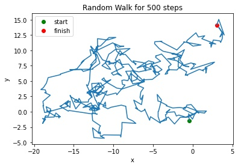

# Random-Walk-2D
The repository is about simulating 2-dimensional random walk.

## step_gauss
Each step of the walk is performed in the following way. A number between 0 and 2 pi from uniform distribution is a direction of a movement (here I use cartesian system of coordinates). The length of a move is a modulus of a random variable from **gaussian distribution**.

An exemplary trajectory for such movement:

