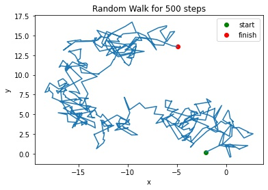
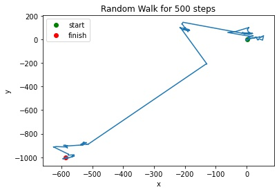
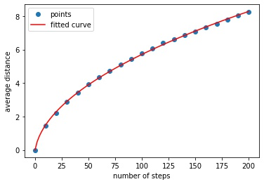
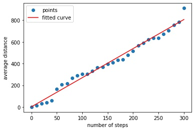

# Random-Walk-2D
The repository is about simulating 2-dimensional random walk.

## random_walk
Each step of the walk is performed in the following way. A number between 0 and 2 pi from uniform distribution is a direction of a movement (here I use cartesian system of coordinates). The length of a move is a modulus of a random variable from

1.**Gaussian distribution**:

2.**Cauchy distribution**:

It appears that average travelled distance is proportional to sqrare root of number of steps for gaussian distribution and linear for cauchy distribution:

